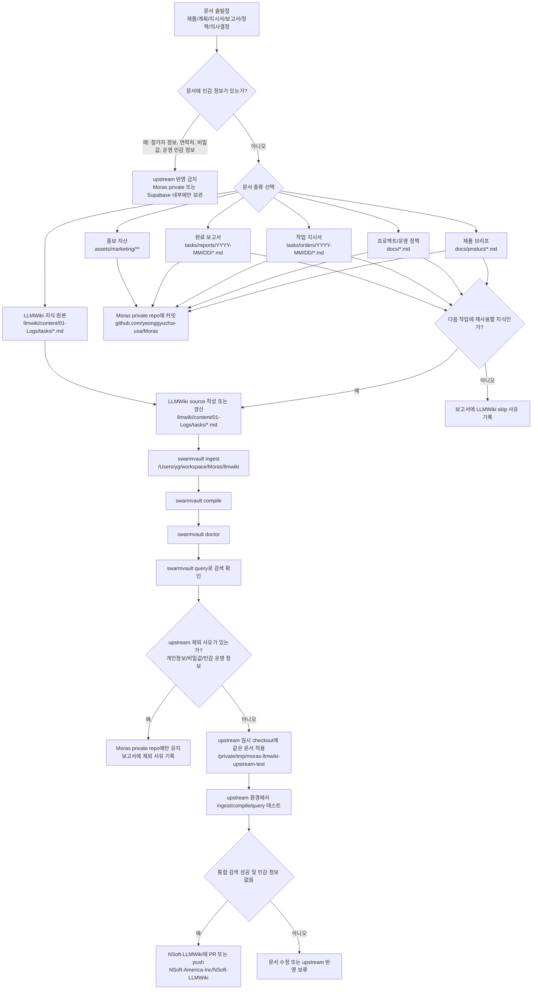
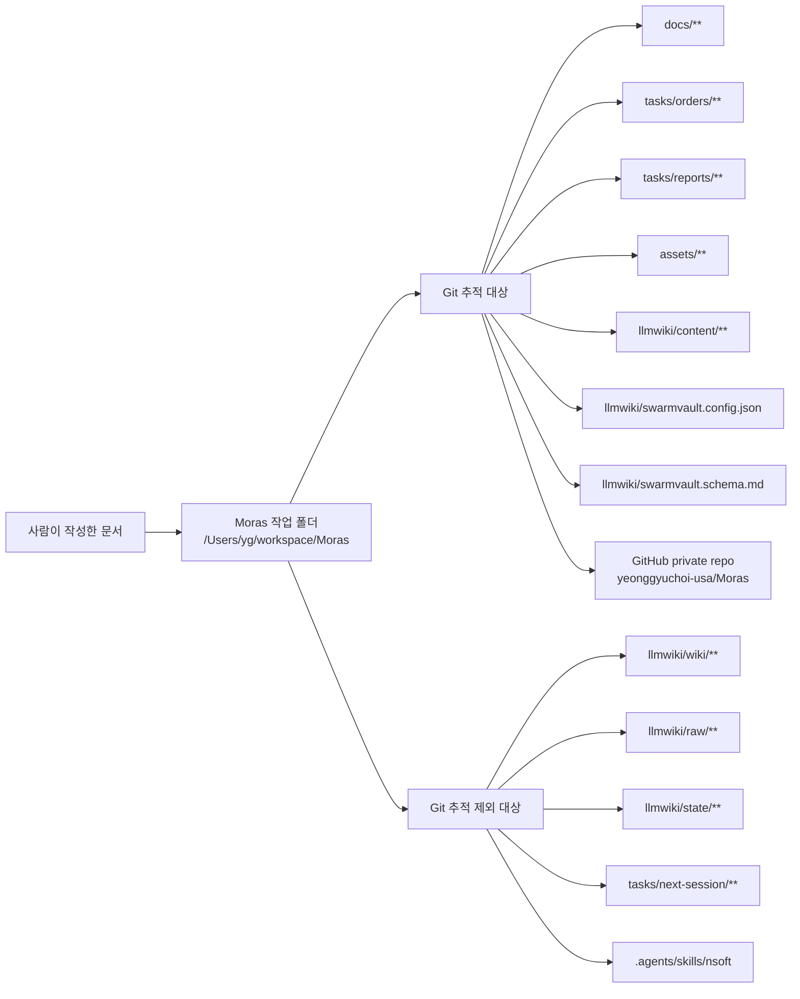
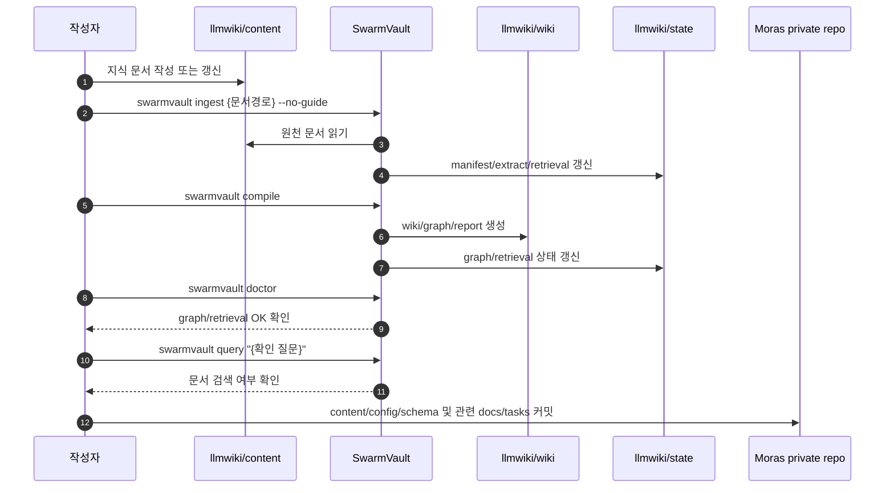
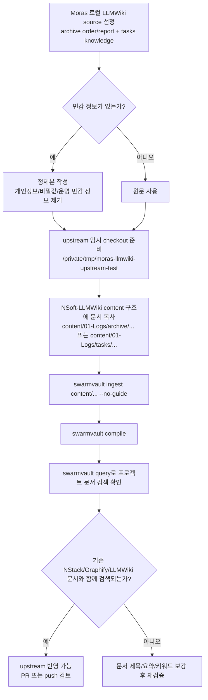

# Moras 문서 통합 플로우

## 목적

이 문서는 Moras에서 생성되는 문서가 어디에서 시작해서, 어떤 폴더와 GitHub 저장소를 거쳐, 어떻게 LLMWiki와 NStack 통합 지식체계로 들어가는지 정의한다.

Moras만의 특수 규칙이 아니라, NStack 기반 프로젝트들이 공통으로 따라야 할 문서 통합 모델을 Moras 파일럿에서 검증하는 문서다.

핵심 원칙은 다음과 같다.

- 사람이 작성한 원천 문서와 SwarmVault 생성물을 분리한다.
- 각 프로젝트의 작업 문서는 최종적으로 통합 LLMWiki에 들어가는 것을 기본값으로 한다.
- 프로젝트 private repo와 upstream `NSoft-LLMWiki` repo의 역할을 분리한다.
- 개인정보나 이벤트 운영 민감 정보만 upstream 통합 대상에서 제외한다.
- 모든 주요 문서 흐름은 NStack 파일럿 검증 근거가 된다.

## 대상 저장소와 로컬 경로

| 대상 | 위치 | 역할 | 접근 범위 |
|---|---|---|---|
| Moras 로컬 작업 폴더 | `/Users/yg/workspace/Moras` | Moras 제품 개발과 NStack 파일럿 작업 공간 | 로컬 |
| Moras GitHub repo | `https://github.com/yeonggyuchoi-usa/Moras` | Moras private 원천 저장소 | 개인 계정 private, 본인만 접근 |
| Moras 로컬 LLMWiki | `/Users/yg/workspace/Moras/llmwiki` | Moras 전용 지식 vault | 로컬 + Moras private repo 일부 |
| NStack 로컬 기준 repo | `/Users/yg/workspace/NStack` | NStack 규칙, 스킬, 기준 문서 참조 | 로컬 |
| upstream 통합 LLMWiki repo | `NSoft-America-Inc/NSoft-LLMWiki` | 조직 통합 지식체계 | private, 각 프로젝트의 공유 가능/정제 문서가 모이는 최종 지식 저장소 |
| upstream 임시 테스트 checkout | `/private/tmp/moras-llmwiki-upstream-test` | upstream 반영 전 통합 테스트 | 로컬 임시 |

## 문서 종류

| 문서 종류 | 출발 위치 | Moras repo 커밋 | 로컬 LLMWiki 반영 | upstream 통합 LLMWiki 반영 |
|---|---|---:|---:|---:|
| 제품 브리프 | `docs/product/` | 예 | 요약본 반영 | 원칙적으로 예, 민감 정보 제거 후 |
| 프로젝트 계획 | `docs/` | 예 | 예 | 예 |
| LLMWiki 운영 정책 | `docs/` | 예 | 예 | 예 |
| 작업 지시서 | `tasks/orders/` | 예 | archive order로 반영 | 예 |
| 완료 보고서 | `tasks/reports/` | 예 | archive report로 반영 | 예 |
| 작업 지식 문서 | `llmwiki/content/01-Logs/tasks/` | 예 | 예 | 예 |
| 개발 의사결정 | `docs/` 또는 `tasks/reports/` | 예 | 예 | 예 |
| 홍보 이미지/자산 | `assets/` | 예 | 설명만 필요 시 반영 | 보통 아니오 |
| 참가자 데이터 | Supabase | 아니오 | 아니오 | 절대 아니오 |
| 비밀값/환경변수 | `.env*`, Netlify env, Supabase secret | 아니오 | 아니오 | 절대 아니오 |
| SwarmVault 생성 wiki | `llmwiki/wiki/` | 아니오 | 생성물 | 아니오 |
| SwarmVault raw/state | `llmwiki/raw/`, `llmwiki/state/` | 아니오 | 로컬 생성물 | 아니오 |

## 전체 플로우차트

## NStack 표준 3파일 세트

NStack 기준으로 한 작업은 다음 세 파일이 통합 지식체계의 기본 단위가 된다.

| 단계 | Moras 로컬 출발점 | Moras LLMWiki 반영 위치 | upstream NSoft-LLMWiki 반영 위치 |
|---|---|---|---|
| 지시서 승인 직후 | `tasks/orders/YYYY-MM/DD/{slug}.md` | `llmwiki/content/01-Logs/archive/YYYY-MM/{slug}/order.md` | `content/01-Logs/archive/YYYY-MM/{slug}/order.md` |
| 완료 보고서 작성 직후 | `tasks/reports/YYYY-MM/DD/{slug}.md` | `llmwiki/content/01-Logs/archive/YYYY-MM/{slug}/report.md` | `content/01-Logs/archive/YYYY-MM/{slug}/report.md` |
| 지식화 문서 작성 | `llmwiki/content/01-Logs/tasks/YYYY-MM-DD-{slug}.md` | 동일 경로 | `content/01-Logs/tasks/YYYY-MM-DD-{slug}.md` |

이 세 파일 중 upstream에 올릴 수 없는 내용이 있으면, 민감 정보를 제거한 정제본을 만들어 반영한다. 정제해도 공유할 수 없다면 보고서에 skip 사유를 기록한다.

## Moras private repo 내부 흐름

## LLMWiki 검증 순서

SwarmVault 명령은 같은 vault에서 병렬 실행하지 않는다. 이전 테스트에서 병렬 실행 시 `database is locked` 오류가 발생했다.

## upstream 통합 테스트 흐름

## 현재 기준 문서

| 문서 | 경로 |
|---|---|
| 제품 브리프 | `docs/product/moras-product-brief.md` |
| 프로젝트 계획 | `docs/project-plan.md` |
| LLMWiki 운영 정책 | `docs/llmwiki-policy.md` |
| LLMWiki 정책 source | `llmwiki/content/01-Logs/tasks/2026-05-16-moras-llmwiki-policy.md` |
| 제품 정의 source | `llmwiki/content/01-Logs/tasks/2026-05-16-moras-product-definition.md` |
| 프로젝트 계획 source | `llmwiki/content/01-Logs/tasks/2026-05-16-moras-project-plan.md` |

## 다음 작업에서 지켜야 할 것

- 기능 작업마다 `tasks/orders/`에 지시서를 만든다.
- 완료 후 `tasks/reports/`에 보고서를 만든다.
- 지시서와 보고서는 `llmwiki/content/01-Logs/archive/YYYY-MM/{slug}/`에 archive한다.
- 다음 작업에 재사용할 지식은 `llmwiki/content/01-Logs/tasks/`에 남긴다.
- LLMWiki 검증은 순차 실행한다.
- upstream 통합은 기본값이며, 제외 시 민감 정보 또는 명시적 skip 사유를 남긴다.
